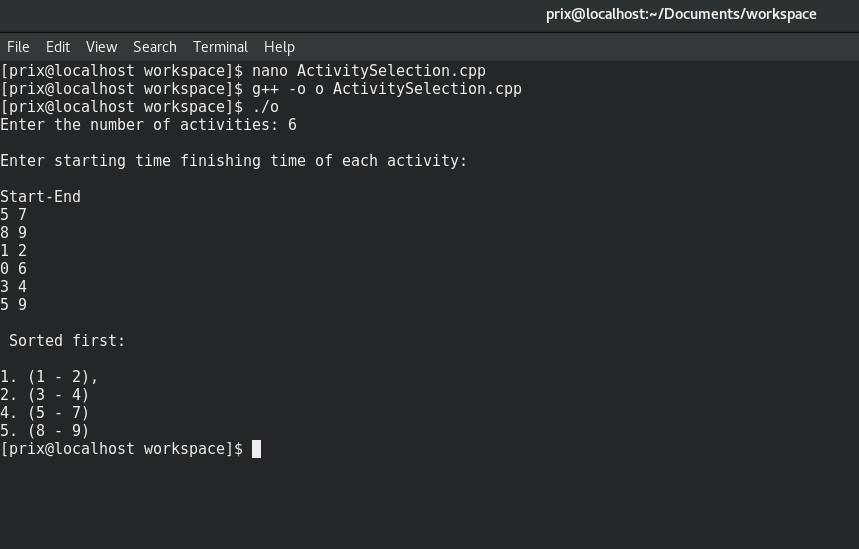
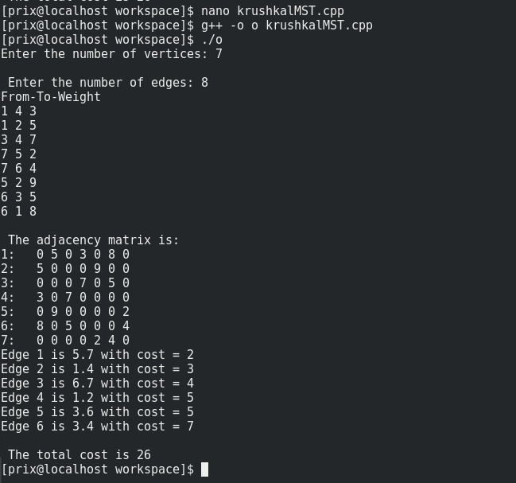
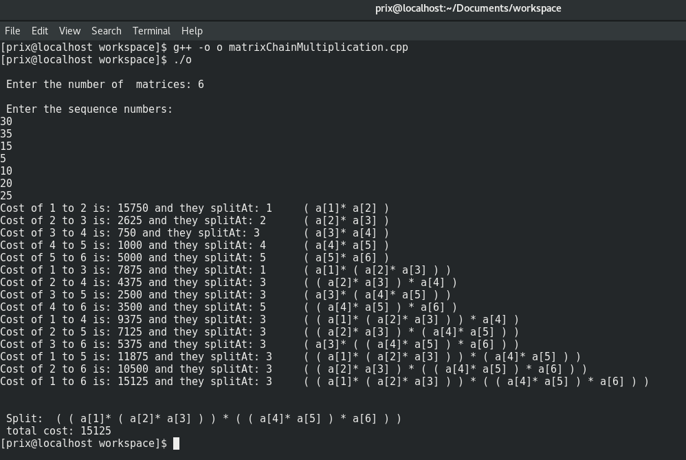
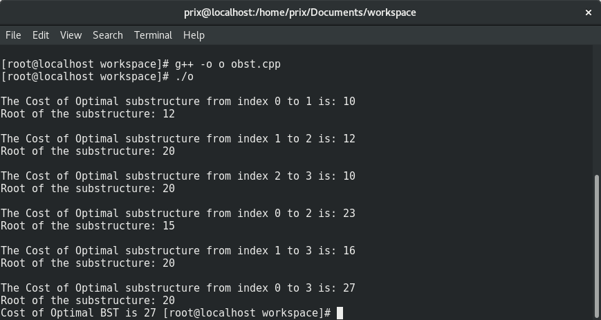

## Advanced Algorithms
List of different algorithms implemented using Dynamic Programming, Greedy Programming etc.

## Activity Selection

<break />

## Krushkal MST

<break />

## Matrix Chain

<break />

## OBST

